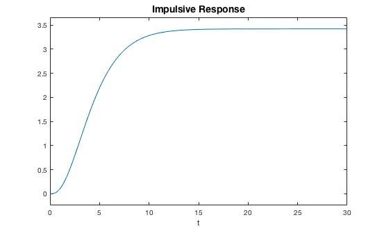

# NN-Training-as-Dynamical-Process
In this repository you will find the essentials Matlab scripts to simulating the algorithm proposed in the paper:

_"Neural Network Training as a Dissipative Process"_    (Marco Gori, Marco Maggini, Alessandro Rossi , 2016) 


## Functions

[TRnet.m](https://github.com/alered87/NN-Training-as-Dynamical-Process/blob/master/TRnet.m)
Is the main function in which we define the class containing all the variables and methods for the implementation of a 2-layer Neural Network, trainable in a standard mode or with the dissipative dynamic system proposed in the paper.

[makeSystemMatrix.m](https://github.com/alered87/NN-Training-as-Dynamical-Process/blob/master/makeSystemMatrix.m) 
Computes the matrices defining the dynamical system, given the parameters (called by [TRnet.m](https://github.com/alered87/NN-Training-as-Dynamical-Process/blob/master/TRnet.m) at the initialization)

[PlotImpulsiveResponse.m](https://github.com/alered87/NN-Training-as-Dynamical-Process/blob/master/PlotImpulsiveResponse.m) 
Plots the Impulsive Response of the dynamical system, given the roots of the characteristic polynomial (just to visualize the impulsive response if needed)


## Data

Data must be provided to the algorithm in a single `struct` variable with fields
* X : input_size-by-number_of_samples matrix of training data
* Y : output_size-by-number_of_samples matrix of target for training data (Inf/NaN means unsupervised sample)
* Xtest : input_size-by-number_of_samples matrix of test data
* Ytest : output_size-by-number_of_samples matrix of target for test data (Inf/NaN means unsupervised sample)

The provided dataset (already in the required form) are:
* reducedMnistData.mat : contains a subset (10000 elements) of the MNIST dataset [1]
* vowels.mat : contains a toy dataset for vowels classification task (many unsupervised samples, target = Inf)


## Usage 

The object can be initialized by 
```matlab
net = TRnet
```
all the argument of [TRnet.m](https://github.com/alered87/NN-Training-as-Dynamical-Process/blob/master/TRnet.m) are optionals and have to be called in argument-value pair; dissipative training can be selected by the boolean property `dissipativeTraining` ; the weights of the networks and the matrices defining the dynamical system are initializated at the first training calling or by the function 

```matlab
net.initialization(inputSize,outputSize)
````

at this point the dinamical system is defined (if `net.dissipativeTraining = 1`) and the Impulsive Response can be seen by:

```matlab
imre = PlotImpulsiveResponse(net.solutions,0,30)
````
<br/>

The network training can be started by 

```matlab
net.train(data,maxEpochs)
```

The object `net` save the performance during training on train and test set in the fields `trainAccuracy`,`trainMSE`,`testAccuracy`,`testMSE`


##Contacts: 
Alessandro Rossi : rossi111@unisi.it

##References:
[1] see: http://yann.lecun.com/exdb/mnist/
